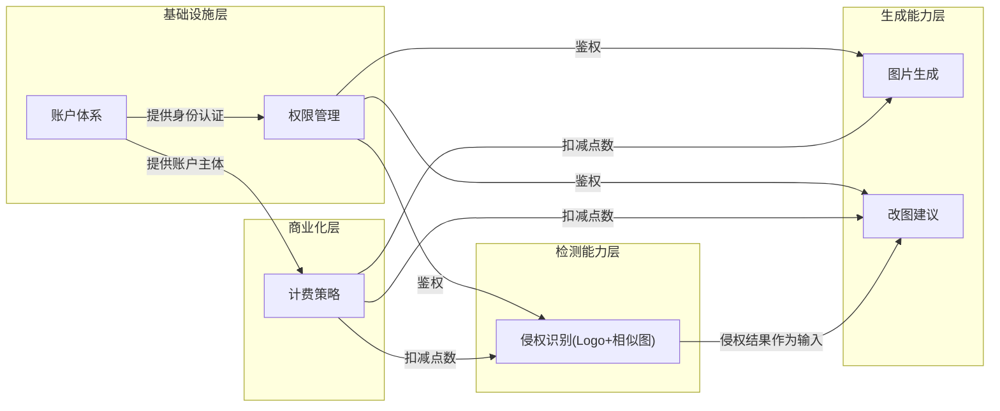
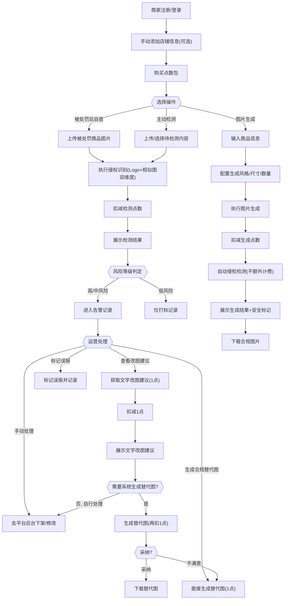
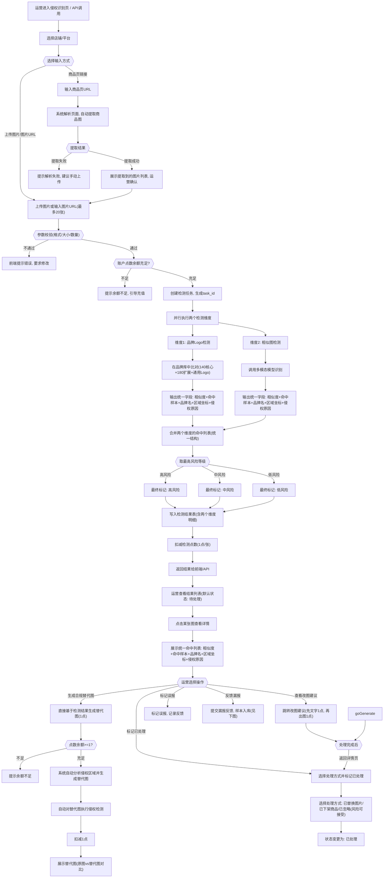
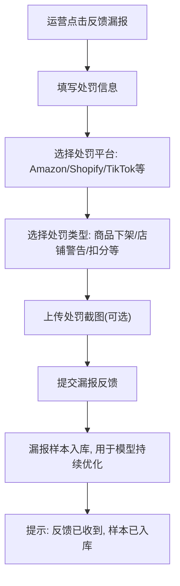
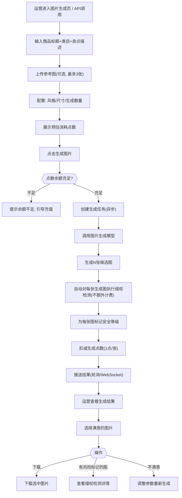
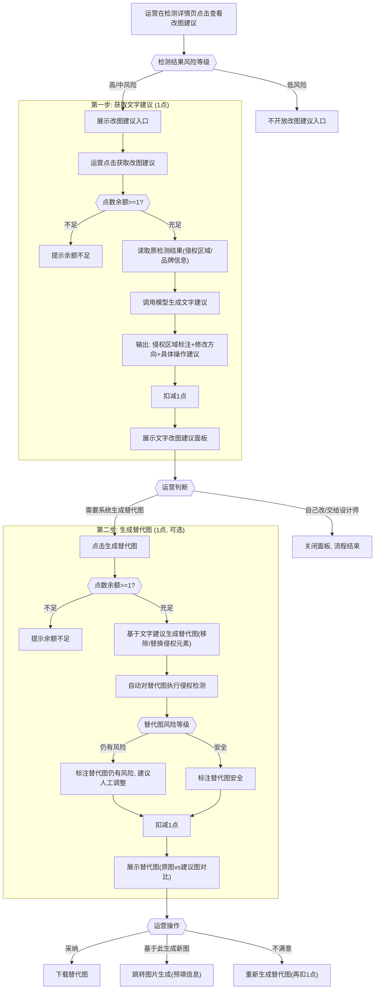

# 百级别DHgate AI 风控 SaaS — P0 产品方案

> 版本：v1.0 | 更新日期：2026-03-05

---

## 目录

1. [产品概述](#1-产品概述)
2. [P0 功能模块全景与端到端流程](#2-p0-功能模块全景)
3. [基础设施层：账户体系与权限管理](#3-基础设施层账户体系与权限管理)
4. [检测能力层：侵权识别](#4-检测能力层侵权识别)
5. [生成能力层：图片生成与改图建议](#5-生成能力层图片生成与改图建议)
6. [商业化层：计费策略](#6-商业化层计费策略)
7. [MVP 边界与后续规划](#7-mvp-边界与后续规划)

---

## 1. 产品概述

### 1.1 产品定位

AI 风控 SaaS 是一款面向**跨境电商商家**的多模态内容风控平台，帮助商家在商品上架前和运营过程中，对商品图片、文本、视频等多维度内容进行**侵权检测、内容安全审核、文本合规检查**，并在检测出风险后提供**合规图片生成与改图建议**，形成"检测 → 告警 → 修复"的完整闭环。

### 1.2 目标用户


| 维度   | 描述                                                     |
| ---- | ------------------------------------------------------ |
| 用户角色 | 跨境电商商家团队中的**运营人员**                                     |
| 典型画像 | 在 Amazon、TikTok Shop、独立站等平台经营的中小型卖家团队，日常需要上架/维护商品、投放广告 |
| 核心痛点 | 因商品图/文案侵权被平台下架、罚款甚至封店；缺乏高效的侵权自查工具；被罚后不知如何修改合规          |
| 使用场景 | 新品上架前自查、存量商品巡检、被平台处罚后排查与修复                             |


### 1.3 核心价值主张

**一次调用，多维度风控结果 + 合规修复方案。**

与竞品（如睿观 ERiC）"各场景分别调用"不同，本产品的核心差异化在于：

- **多场景联动**：单次检测请求同时返回品牌侵权、内容安全、文本合规等多维度结果，降低商家接入与使用成本。
- **检测 + 生成闭环**：不仅告诉商家"哪里有问题"，还提供"怎么改"的合规图片生成与改图建议。
- **真实数据背书**：基于敦煌网平台真实违规数据训练，对跨境电商侵权场景的表现形式理解更深。

### 1.4 竞品差异化分析（vs 睿观 ERiC）


| 能力维度             | 我方                       | 睿观 ERiC         | 竞争关系      |
| ---------------- | ------------------------ | --------------- | --------- |
| 侵权识别（Logo + 相似图） | 百级别品牌库 + 相似图比对，一次调用双维度检测 | 注册商标库比对（无相似图能力） | **我方领先**  |
| 黄检 / 色情识别        | 已有，平台验证                  | 无               | **我方独有**  |
| 违禁词检测            | 品牌词 + 敏感词                | 文本商标            | 各有侧重      |
| 图片生成             | 合规主图生成（基础能力）             | 专利智坊（改图建议）      | 各有侧重      |
| 改图建议             | 基础能力，待完善                 | 较成熟             | 我方落后      |
| 外观专利检测           | 无                        | 1.6 亿+专利库       | 我方缺失      |
| **多场景联动**        | **一次调用返回多维度结果**          | 各场景分别调用         | **核心差异化** |
| 数据可信度            | 敦煌网真实业务验证                | 自我宣称，无第三方验证     | **我方优势**  |


---

## 2. P0 功能模块全景

```
┌─────────────────────────────────────────────────────────┐
│                    AI 风控 SaaS P0 架构                    │
├─────────────────────────────────────────────────────────┤
│  商业化层     │  计费策略（点数制/按量/套餐、账单、充值）     │
├─────────────────────────────────────────────────────────┤
│  生成能力层   │  图片生成          │  改图建议              │
├─────────────────────────────────────────────────────────┤
│  检测能力层   │  侵权识别（Logo + 相似图）                    │
├─────────────────────────────────────────────────────────┤
│  基础设施层   │  账户体系          │  权限管理              │
└─────────────────────────────────────────────────────────┘
```

### 模块依赖关系（从下往上阅读）

下图用**泳道**分层展示各模块间的依赖关系。箭头含义为"被依赖方 → 依赖方"，即箭头指向的模块需要箭头起点模块提供能力。




**依赖关系说明：**


| 依赖路径          | 含义                              |
| ------------- | ------------------------------- |
| 账户体系 → 权限管理   | 权限管理基于账户体系的用户/子账号身份进行角色分配       |
| 账户体系 → 计费策略   | 计费以账户为主体进行点数充值和消耗记录             |
| 权限管理 → 所有业务模块 | 每个业务功能调用前需通过权限校验（角色是否有权访问）      |
| 计费策略 → 所有业务模块 | 每次检测/生成操作需先校验余额并扣减点数            |
| 侵权识别 → 改图建议   | 改图建议需要以检测结果（侵权区域、命中品牌、相似图等）作为输入 |


### 端到端业务流程

#### 总体流程



#### 典型操作路径

**路径 A：新品上架前自查**

1. 运营登录 → 进入「内容检测」
2. 选择店铺/平台 → 上传新品主图（多张）
3. 点击「开始检测」，系统自动执行 Logo + 相似图双维度侵权识别
4. 查看结果 → 高风险图片点击「改图建议」→ 查看文字建议 → 需要则点击「生成替代图」→ 下载替代图
5. 用替代图去平台上架

**路径 B：缺少商品图，需要生成**

1. 运营登录 → 进入「图片生成」
2. 输入商品标题、类目、卖点 → 选择风格（白底）→ 生成 4 张
3. 查看结果，确认安全标记均为绿色 → 下载图片去平台上架

**路径 C：存量商品批量巡检**

1. 运营登录 → 进入「批量检测」（后续版本，此处仅为路径预留）
2. 选择店铺 → 全部商品 → 执行批量侵权检测
3. 在告警中心处理高风险商品 → 逐个查看改图建议或手动下架

**路径 D：已上架商品被平台处罚后紧急自查**

1. 运营收到平台处罚通知（商品下架/警告/扣分）→ 登录本系统
2. 进入「侵权识别」→ 上传被处罚商品的图片（或输入商品页链接）
3. 点击「开始检测」→ 系统定位具体侵权点（哪个品牌、哪个区域、侵权原因）
4. 点击「获取改图建议」→ 明确需要修改的区域和方向
5. 根据需要选择「生成替代图」或交给设计师处理
6. 用合规图片去平台重新提交申诉/重新上架

---

## 3. 基础设施层：账户体系与权限管理

### 3.1 账户体系

#### 3.1.1 功能描述与目标

为商家提供注册、登录、多账户管理及 API Key 管理能力，作为 SaaS 平台所有业务功能的入口和身份基础。

#### 3.1.2 功能流程图

```mermaid
flowchart TD
  subgraph reg ["注册流程"]
    startReg["访问注册页"] --> chooseRegMethod{{"选择注册方式"}}

    chooseRegMethod -->|"邮箱注册"| inputEmail["输入邮箱+密码+企业信息"]
    inputEmail --> sendEmailVerify["发送邮箱验证邮件"]
    sendEmailVerify --> clickVerify["用户点击验证链接"]
    clickVerify --> regSuccess["注册成功, 自动登录"]

    chooseRegMethod -->|"手机号注册"| inputPhone["输入手机号+企业信息"]
    inputPhone --> sendSMS["发送短信验证码"]
    sendSMS --> inputSMSCode["用户输入验证码"]
    inputSMSCode --> verifySMS{{"验证码校验"}}
    verifySMS -->|"正确"| setPassword["设置登录密码"]
    verifySMS -->|"错误/过期"| retrySMS["提示错误, 可重新发送"]
    setPassword --> regSuccess

    regSuccess --> grantFreePack["赠送100点体验包"]
  end

  subgraph login ["登录流程"]
    startLogin["访问登录页"] --> chooseLoginMethod{{"选择登录方式"}}
    chooseLoginMethod -->|"邮箱+密码"| inputEmailCred["输入邮箱+密码"]
    chooseLoginMethod -->|"手机号+密码"| inputPhoneCred["输入手机号+密码"]
    chooseLoginMethod -->|"手机号+验证码"| inputPhoneSMS["输入手机号+短信验证码"]
    inputEmailCred --> authCheck{{"认证校验"}}
    inputPhoneCred --> authCheck
    inputPhoneSMS --> authCheck
    authCheck -->|"成功"| enterDashboard["进入控制台首页"]
    authCheck -->|"失败"| showError["提示错误, 可重试/重置密码"]
  end

  subgraph shopMgmt ["店铺管理流程(MVP)"]
    enterShopMgmt["进入店铺管理"] --> addShop["手动添加店铺信息"]
    addShop --> inputShopInfo["填写: 店铺名称/平台/站点"]
    inputShopInfo --> saveShop["保存店铺信息"]
    saveShop --> shopReady["店铺创建完成, 可用于检测时关联"]
  end

  subgraph apiKey ["API Key管理流程"]
    enterApiMgmt["进入API Key管理"] --> createKey["点击创建API Key"]
    createKey --> checkLimit{{"已有Key数量 < 5?"}}
    checkLimit -->|"是"| generateKey["系统生成Key+Secret"]
    checkLimit -->|"否"| limitError["提示已达上限"]
    generateKey --> showSecret["展示Secret(仅一次)"]
    showSecret --> keyReady["Key生效, 可用于API调用"]
  end
```




#### 3.1.3 核心用户故事


| 编号    | 用户故事                                             |
| ----- | ------------------------------------------------ |
| US-01 | 作为商家运营，我希望通过邮箱或手机号注册账号并登录系统，以使用风控检测功能            |
| US-02 | 作为商家运营，我希望手动添加我的店铺信息（名称/平台/站点），以便检测结果可按店铺维度管理和统计 |
| US-03 | 作为商家运营，我希望生成和管理 API Key，以便将风控能力集成到自有系统中          |
| US-04 | 作为商家负责人，我希望创建子账号给团队成员使用，以实现多人协作                  |


#### 3.1.3 页面结构

**注册/登录页**

- 注册方式：邮箱 + 密码 或 手机号 + 短信验证码（注册后需设置密码），后续可扩展第三方 OAuth（Google 等）
- 登录方式：邮箱 + 密码 / 手机号 + 密码 / 手机号 + 短信验证码（三选一）
- 忘记密码：通过邮箱验证码或手机短信验证码重置

**账户设置页**

- 基本信息：企业名称、联系人、联系方式
- 店铺管理：手动添加/编辑/删除店铺（填写店铺名称、所属平台、站点），用于检测结果的分店铺管理和统计。MVP 阶段不对接平台 API，不自动同步商品数据。
- API Key 管理：创建/删除/启用/禁用 API Key，展示调用量统计

#### 3.1.4 关键字段定义


| 字段           | 类型     | 必填      | 说明                         |
| ------------ | ------ | ------- | -------------------------- |
| email        | string | 邮箱注册时必填 | 登录邮箱，全局唯一                  |
| phone_number | string | 手机注册时必填 | 登录手机号，全局唯一，用于短信验证码登录和密码找回  |
| password     | string | 是       | 加密存储，最小 8 位（手机注册时验证码通过后设置） |
| company_name | string | 是       | 企业/店铺名称                    |
| contact_name | string | 是       | 联系人姓名                      |
| api_key      | string | 系统生成    | 用于 API 调用鉴权                |
| api_secret   | string | 系统生成    | 仅创建时展示一次                   |


#### 3.1.5 业务规则

- 每个账户最多创建 5 个 API Key。
- API Key 创建后默认启用；禁用后所有通过该 Key 的请求返回 403。
- MVP 阶段店铺为手动添加（名称+平台+站点），仅用于检测结果的维度归属和统计，不对接第三方平台 API。
- 第三方平台 API 授权对接（Shopify → Amazon → TikTok）计划在 Phase 2/3 实施。

---

### 3.2 权限管理

#### 3.2.1 功能描述与目标

支持主账号创建子账号，并通过角色分配控制子账号对各功能模块的访问权限。MVP 阶段采用简洁的角色模型。

#### 3.2.2 功能流程图

```mermaid
flowchart TD
  subgraph invite ["邀请成员流程"]
    adminEnter["管理员进入团队管理"] --> clickInvite["点击邀请成员"]
    clickInvite --> inputMemberEmail["输入成员邮箱"]
    inputMemberEmail --> selectRole["选择角色(运营/只读)"]
    selectRole --> sendInviteEmail["发送邀请邮件"]
    sendInviteEmail --> memberClick["成员点击邀请链接"]
    memberClick --> hasAccount{{"是否已有账号?"}}
    hasAccount -->|"否"| setPassword["设置密码完成注册"]
    hasAccount -->|"是"| directJoin["直接加入团队"]
    setPassword --> activated["成员状态:已激活"]
    directJoin --> activated
  end

  subgraph permCheck ["权限校验流程(每次操作触发)"]
    userRequest["用户发起操作请求"] --> getRole["获取用户角色"]
    getRole --> checkPerm{{"角色是否有该功能权限?"}}
    checkPerm -->|"有权限"| allowAction["放行, 执行操作"]
    checkPerm -->|"无权限"| denyAction["拒绝, 提示无权限"]
  end

  subgraph roleChange ["角色变更流程"]
    adminEditRole["管理员编辑成员角色"] --> isLastAdmin{{"是否为最后一个管理员?"}}
    isLastAdmin -->|"是"| blockChange["禁止变更, 提示需保留至少一个管理员"]
    isLastAdmin -->|"否"| updateRole["更新角色"]
    updateRole --> notifyMember["通知成员角色已变更"]
  end
```




#### 3.2.3 角色定义


| 角色           | 说明               | 获得方式             |
| ------------ | ---------------- | ---------------- |
| 管理员（Owner）   | 拥有全部权限，负责账户管理和计费 | 注册时自动获得，不可删除     |
| 运营（Operator） | 日常使用检测和生成功能的执行者  | 管理员邀请时指定，子账号默认角色 |
| 只读（Viewer）   | 仅查看数据，不可执行任何操作   | 管理员邀请时指定         |


#### 3.2.4 角色权限矩阵

下表按功能模块逐项列出每个角色的操作权限：

**账户与团队管理**


| 功能点                 | 管理员（Owner） | 运营（Operator） | 只读（Viewer） |
| ------------------- | ---------- | ------------ | ---------- |
| 修改企业基本信息（名称/联系人等）   | 可操作        | 不可           | 不可         |
| 添加/编辑/删除店铺          | 可操作        | 不可           | 不可         |
| 创建/删除/启用/禁用 API Key | 可操作        | 不可           | 不可         |
| 查看 API Key 调用量      | 可查看        | 可查看          | 不可         |
| 邀请成员                | 可操作        | 不可           | 不可         |
| 编辑成员角色              | 可操作        | 不可           | 不可         |
| 移除成员                | 可操作        | 不可           | 不可         |
| 查看团队成员列表            | 可查看        | 可查看          | 可查看        |


**侵权识别**


| 功能点                | 管理员（Owner） | 运营（Operator） | 只读（Viewer） |
| ------------------ | ---------- | ------------ | ---------- |
| 发起实时侵权检测（上传图片/URL） | 可操作        | 可操作          | 不可         |
| 查看检测结果列表           | 可查看        | 可查看          | 可查看        |
| 查看检测结果详情           | 可查看        | 可查看          | 可查看        |
| 标记误报               | 可操作        | 可操作          | 不可         |
| 通过 API 调用检测接口      | 可调用        | 可调用          | 不可         |


**图片生成**


| 功能点    | 管理员（Owner） | 运营（Operator） | 只读（Viewer） |
| ------ | ---------- | ------------ | ---------- |
| 发起图片生成 | 可操作        | 可操作          | 不可         |
| 查看生成结果 | 可查看        | 可查看          | 可查看        |
| 下载生成图片 | 可操作        | 可操作          | 不可         |


**改图建议**


| 功能点      | 管理员（Owner） | 运营（Operator） | 只读（Viewer） |
| -------- | ---------- | ------------ | ---------- |
| 获取改图建议   | 可操作        | 可操作          | 不可         |
| 下载替代图    | 可操作        | 可操作          | 不可         |
| 查看历史改图记录 | 可查看        | 可查看          | 可查看        |


**计费中心**


| 功能点        | 管理员（Owner） | 运营（Operator） | 只读（Viewer） |
| ---------- | ---------- | ------------ | ---------- |
| 充值/购买点数包   | 可操作        | 不可           | 不可         |
| 设置余额预警阈值   | 可操作        | 不可           | 不可         |
| 查看当前余额     | 可查看        | 可查看          | 可查看        |
| 查看消费明细     | 可查看        | 可查看          | 可查看        |
| 导出消费明细 CSV | 可操作        | 不可           | 不可         |
| 查看购买记录     | 可查看        | 不可           | 不可         |
| 查看消费趋势图    | 可查看        | 可查看          | 可查看        |


#### 3.2.5 权限设计原则

- **管理员（Owner）**：拥有全部权限，是唯一可以管理账户设置、团队成员和计费充值的角色。涉及「花钱」和「改配置」的操作只有管理员能做。
- **运营（Operator）**：可以使用所有业务功能（检测、生成、改图），但不能碰账户设置和计费。日常工作完全自主，不需要管理员介入。
- **只读（Viewer）**：只能看数据（检测结果、消费趋势等），不能发起任何消耗点数的操作，也不能修改任何配置。适合老板/负责人查看业务状况。

#### 3.2.6 页面结构

**团队管理页**

- 成员列表：邮箱、角色、状态（已激活/待激活）、最近登录时间、操作（编辑角色/移除）
- 邀请成员：输入邮箱 + 选择角色 → 发送邀请邮件
- 编辑角色：下拉选择角色

#### 3.2.7 业务规则

- 管理员角色不可被其他管理员移除（账户至少保留一个管理员）。
- 子账号通过邀请邮件中的链接完成注册激活。
- MVP 阶段每个账户最多 10 个成员。

---

## 4. 检测能力层：侵权识别

### 4.1 侵权识别

#### 4.1.1 功能描述与目标

侵权识别是一个统一的检测功能，内部整合两个检测维度，**一次调用同时完成**，两个维度输出**统一字段结构**：

- **品牌 Logo 检测**：基于品牌库比对识别（140 个核心品牌 + 180 个扩展品牌 + 通用 Logo 泛化识别），检测图片中是否包含他人品牌标识。准确率目标 90-95%。
- **相似图检测**：通过**多模态模型**识别，将待检测图与已知侵权样本进行深度语义比对，识别通过裁剪、旋转、调色、加水印等手段规避检测的"改图侵权"行为。

两个维度虽然底层识别方法不同（品牌库比对 vs 多模态模型），但对运营来说输出格式完全一致——每条命中结果都包含：**相似度、命中样本、品牌名、区域坐标、侵权原因**。运营不需要关心后面是哪个引擎跑的，只看统一的结果列表。

#### 4.1.2 功能流程图



**漏报反馈流程（从主流程"反馈漏报"入口进入）**



#### 4.1.3 核心用户故事


| 编号    | 用户故事                                                                                        |
| ----- | ------------------------------------------------------------------------------------------- |
| US-05 | 作为运营，我希望上传商品主图后系统自动识别是否含有品牌 Logo 侵权或与已知侵权图高度相似，以避免上架后被平台处罚                                  |
| US-06 | 作为运营，我希望对已上架的全部商品发起批量侵权扫描，以排查存量商品中的潜在风险                                                     |
| US-07 | 作为运营，我希望在检测结果中看到统一格式的命中列表（相似度、命中样本图、品牌名、区域坐标、侵权原因），不管是 Logo 维度还是相似图维度，一眼就能判断风险点在哪并知道为什么判定侵权 |
| US-08 | 作为运营，我希望检测结果有处理状态（待处理/已处理/误报），以便追踪每张图的处理进度，避免遗漏                                             |
| US-09 | 作为运营主管，我希望能按处理状态筛选检测结果，快速了解团队的风险处理进度和闭环率                                                    |
| US-10 | 作为运营，当之前检测为低风险的商品被平台实际处罚时，我希望能反馈漏报并让系统重新检测，帮我快速定位侵权原因以便申诉或整改                                |


#### 4.1.4 页面结构

**侵权识别页（实时检测入口）**

```
┌──────────────────────────────────────────────────────┐
│  侵权识别                                              │
├──────────────────────────────────────────────────────┤
│  店铺/平台: [Amazon - 店铺A ▼]                         │
├──────────────────────────────────────────────────────┤
│  输入方式: [● 上传图片]  [○ 商品页链接]                  │
│                                                      │
│  上传图片模式:                                         │
│  ┌──────────────────────────────────────────────┐     │
│  │  拖拽上传图片 / 点击选择文件                      │     │
│  │  支持 JPG/PNG/WEBP，单张 ≤ 10MB，批量 ≤ 20 张    │     │
│  │  或输入图片 URL（每行一个）                       │     │
│  └──────────────────────────────────────────────┘     │
│                                                      │
│  商品页链接模式:                                       │
│  ┌──────────────────────────────────────────────┐     │
│  │  输入商品页URL                                  │     │
│  │  [https://www.amazon.com/dp/B0XXXXX      ]   │     │
│  │  支持: Amazon / Shopify / TikTok Shop 等      │     │
│  │  [解析图片]  系统自动提取商品页中的所有图片       │     │
│  └──────────────────────────────────────────────┘     │
│                                                      │
│  [开始检测]    系统自动执行 Logo + 相似图双维度检测      │
├──────────────────────────────────────────────────────┤
│  检测结果             筛选: [全部状态▼] [全部风险▼]       │
│  ┌──────────────────────────────────────────────────────┐│
│  │缩略图│文件名│风险等级│品牌名│相似度│处理状态│操作    ││
│  │[img]│a.jpg│🔴高   │Nike │0.92 │⚪待处理│详情    ││
│  │[img]│b.png│🟡中   │Gucci│0.72 │⚪待处理│详情    ││
│  │[img]│c.jpg│🟢低   │-    │0.12 │🟢已处理│详情    ││
│  │[img]│d.png│🔴高   │LV   │0.88 │⚫误报  │详情    ││
│  └──────────────────────────────────────────────────────┘│
│  批量操作: [□全选] [批量标记已处理▼] [批量标记误报]        │
└──────────────────────────────────────────────────────┘
```

**检测结果详情页**

```
┌──────────────────────────────────────────────────────┐
│  检测详情 - a.jpg                     风险等级: 🔴 高风险│
├──────────────────────────────────────────────────────┤
│  ┌─────────────┐                                      │
│  │             │   命中列表（统一字段，按相似度降序排列）     │
│  │  [原图+标注] │                                      │
│  │  (红/蓝框标出│   命中1 [Logo维度]                     │
│  │   各命中区域) │   品牌名: Nike                        │
│  │             │   相似度: 0.92                        │
│  └─────────────┘   命中样本: [品牌库样本缩略图]           │
│                    区域坐标: (x:23,y:45,w:80,h:60)      │
│                    侵权原因: 图片含有Nike商标Logo,        │
│                    与核心品牌库中Nike标准Logo高度匹配      │
│                                                      │
│                    命中2 [相似图维度]                    │
│                    品牌名: Nike                        │
│                    相似度: 0.45                        │
│                    命中样本: [侵权库样本缩略图]           │
│                    区域坐标: (x:120,y:200,w:150,h:90)   │
│                    侵权原因: 图片主体与已知侵权样本构图   │
│                    相似,疑似通过裁剪方式规避检测           │
├──────────────────────────────────────────────────────┤
│  综合判定: 最高相似度 0.92 (Logo维度), 判定为高风险       │
│  处理建议: 建议移除或替换含有 Nike Logo 的区域            │
│  当前状态: ⚪ 待处理                                    │
├──────────────────────────────────────────────────────┤
│  处理操作:                                             │
│  [生成合规替代图(1点)]  [查看改图建议(1点)]  [标记为误报]   │
│                                                      │
│  变更状态:                                             │
│  [标记已处理 ▼]  → 已替换图片 / 已下架商品 / 已忽略       │
│                                                      │
│  [反馈漏报: 该图被平台实际处罚]                            │
└──────────────────────────────────────────────────────┘
```

**检测记录页（历史记录，以图片维度平铺展示）**

```
┌──────────────────────────────────────────────────────┐
│  检测记录                                              │
├──────────────────────────────────────────────────────┤
│  筛选条件                                              │
│  时间范围: [最近7天▼]  风险等级: [全部▼]                │
│  处理状态: [全部▼]     店铺: [全部▼]                    │
│  搜索: [输入图片名称/品牌名]                    [搜索]  │
├──────────────────────────────────────────────────────┤
│  共 156 条记录                                         │
│  ┌──────────────────────────────────────────────────┐ │
│  │缩略图│文件名│检测时间    │风险等级│品牌名│相似度│处理状态│操作│ │
│  │[img]│a.jpg│03-05 14:32│🔴高   │Nike │0.92 │⚪待处理│详情│ │
│  │[img]│b.png│03-05 14:32│🟡中   │Gucci│0.72 │🟢已处理│详情│ │
│  │[img]│c.jpg│03-04 10:15│🟢低   │-    │0.12 │🟢已处理│详情│ │
│  │[img]│d.png│03-01 09:30│🔴高   │LV   │0.88 │⚫误报  │详情│ │
│  │[img]│e.jpg│03-01 09:30│🟡中   │Puma │0.65 │⚪待处理│详情│ │
│  └──────────────────────────────────────────────────┘ │
│  批量操作: [□全选] [批量标记已处理▼] [批量标记误报]      │
│  分页: < 1 2 3 ... 8 >                                │
└──────────────────────────────────────────────────────┘
```

#### 4.1.5 输入/输出定义

**检测记录查询（API）**

请求：

| 字段            | 类型     | 必填  | 说明                                                  |
| ------------- | ------ | --- | --------------------------------------------------- |
| page          | int    | 否   | 页码，默认 1                                             |
| page_size     | int    | 否   | 每页条数，默认 20，最大 100                                   |
| start_time    | string | 否   | 起始时间（ISO 8601），如 `2026-03-01T00:00:00Z`             |
| end_time      | string | 否   | 结束时间                                                |
| risk_level    | enum   | 否   | 筛选风险等级：`high` / `medium` / `low`                    |
| review_status | enum   | 否   | 筛选处理状态：`pending` / `resolved` / `false_positive`    |
| shop_id       | string | 否   | 筛选店铺                                                |
| keyword       | string | 否   | 搜索关键词（匹配图片文件名、任务 ID、品牌名）                           |

响应：

| 字段                          | 类型            | 说明                                    |
| --------------------------- | ------------- | ------------------------------------- |
| total                       | int           | 符合条件的记录总数                             |
| page                        | int           | 当前页码                                  |
| records                     | array[object] | 检测记录列表（每条 = 一张图片的检测结果）                |
| records[].result_id         | string        | 检测结果唯一 ID                             |
| records[].task_id           | string        | 所属检测任务 ID                             |
| records[].image_url         | string        | 原图 URL                                |
| records[].image_name        | string        | 图片文件名                                 |
| records[].created_at        | datetime      | 检测时间                                  |
| records[].risk_level        | enum          | 风险等级：`high` / `medium` / `low`        |
| records[].top_brand         | string / null | 最高相似度命中的品牌名（无命中时为空）                   |
| records[].top_similarity    | float         | 最高相似度                                 |
| records[].review_status     | enum          | 处理状态：`pending` / `resolved` / `false_positive` |
| records[].shop_id           | string / null | 关联店铺 ID                               |

---

**检测请求（API）**


| 字段           | 类型            | 必填       | 说明                                         |
| ------------ | ------------- | -------- | ------------------------------------------ |
| images       | array[string] | 条件必填（二选一）| 图片 URL 列表或 Base64 列表，最多 20 张                |
| product_url  | string        | 条件必填（二选一）| 商品页链接，系统自动解析页面提取商品图（支持 Amazon/Shopify/TikTok Shop 等） |
| shop_id      | string        | 否        | 店铺 ID，用于关联店铺维度统计                           |
| callback_url | string        | 否        | 异步回调地址（批量检测时使用）                            |

> `images` 和 `product_url` 二选一。传 `product_url` 时系统自动抓取页面商品图再执行检测。

**检测结果（API 响应）**

> 两个维度的命中结果使用统一字段结构 `hits[]`，通过 `detect_type` 区分来源。


| 字段                             | 类型            | 说明                                                                                    |
| ------------------------------ | ------------- | ------------------------------------------------------------------------------------- |
| task_id                        | string        | 检测任务 ID                                                                               |
| results                        | array[object] | 每张图片的检测结果列表                                                                           |
| results[].result_id            | string        | 单张图片检测结果的唯一 ID（漏报反馈、改图建议等后续操作通过此 ID 关联）                                               |
| results[].image_url            | string        | 原图 URL                                                                                |
| results[].risk_level           | enum          | 综合风险等级：`high` / `medium` / `low`                                                      |
| results[].review_status        | enum          | 处理状态：`pending`（待处理）/ `resolved`（已处理）/ `false_positive`（误报）                            |
| results[].resolve_method       | enum / null   | 处理方式（仅 `resolved` 时有值）：`image_replaced` / `delisted` / `ignored`                      |
| results[].resolved_at          | datetime/null | 处理完成时间                                                                                |
| results[].resolved_by          | string / null | 处理人（用户 ID）                                                                            |
| results[].hits                 | array[object] | **统一命中列表**（Logo 维度 + 相似图维度的结果混排，按相似度降序）                                               |
| results[].hits[].detect_type   | enum          | 检测维度来源：`logo`（品牌库比对）/ `similar`（多模态模型）                                                |
| results[].hits[].similarity    | float         | **相似度**（0-1），Logo 维度为品牌库置信度，相似图维度为模型输出的相似分                                            |
| results[].hits[].ref_image_url | string        | **命中样本** URL（Logo 维度为品牌库标准样本图，相似图维度为侵权库样本图）                                           |
| results[].hits[].brand_name    | string        | **品牌名**（Logo 维度来自品牌库，相似图维度由多模态模型识别输出；未识别时为空）                                          |
| results[].hits[].bbox          | object        | **区域坐标** `{x, y, w, h}`，标记命中区域在原图中的位置                                                 |
| results[].hits[].reason        | string        | **侵权原因**，自然语言描述为什么判定为侵权（Logo 维度由规则生成，相似图维度由多模态模型输出）                                   |
| results[].hits[].ref_source    | string        | 命中样本来源标识：`brand_lib_140` / `brand_lib_180` / `brand_lib_generic` / `infringement_lib` |
| results[].cost_points          | int           | 本次检测消耗的点数                                                                             |

**漏报反馈（API）**

请求：

| 字段                 | 类型     | 必填       | 说明                                           |
| ------------------ | ------ | -------- | -------------------------------------------- |
| result_id          | string | 条件必填（二选一）| 原检测结果 ID（图片之前检测过时传入，精确关联到该次检测结果）             |
| image_url          | string | 条件必填（二选一）| 被处罚的图片 URL（图片未检测过时直接传入图片）                    |
| platform           | enum   | 是        | 处罚平台：`amazon` / `shopify` / `tiktok` / `other` |
| penalty_type       | enum   | 是        | 处罚类型：`listing_removed`（商品下架）/ `warning`（警告）/ `score_deducted`（扣分）/ `other` |
| penalty_screenshot | string | 否        | 处罚截图 URL（商家上传后获得）                            |
| remark             | string | 否        | 补充说明                                         |

> `result_id` 和 `image_url` 二选一：有历史检测记录时传 `result_id`（可追溯原检测结果），没有检测过时传 `image_url`。

响应：

| 字段                    | 类型     | 说明                    |
| --------------------- | ------ | --------------------- |
| feedback_id           | string | 漏报反馈记录 ID             |
| status                | enum   | `submitted`（已提交）      |
| message               | string | 提示信息，如"反馈已收到，样本已入库"  |


#### 4.1.6 业务规则

- **统一计费**：每张图片 1 个检测点数，包含 Logo + 相似图两个维度。
- **统一输出字段**：无论哪个维度命中，每条 hit 都输出：`similarity`（相似度）、`ref_image_url`（命中样本）、`brand_name`（品牌名）、`bbox`（区域坐标）、`reason`（侵权原因）。
- **风险等级映射**（取所有 hits 中的最高相似度）：
  - Logo 维度（品牌库比对）阈值：高风险 ≥ 0.80 / 中风险 0.50~0.80 / 低风险 < 0.50
  - 相似图维度（多模态模型）阈值：高风险 ≥ 0.85 / 中风险 0.60~0.85 / 低风险 < 0.60
  - 最终风险等级 = max(所有 hits 各自对应维度的风险等级)
- **品牌库结构**：
  - 140 核心品牌库：高频侵权品牌，高精度匹配
  - 180 扩展品牌库：中频侵权品牌，补充覆盖面
  - 通用 Logo 泛化识别：兜底能力，识别不在品牌库中的疑似品牌标识
- **处理状态流转**（三态模型）：
  - `待处理` → `已处理`：运营手动标记，需选择处理方式（已替换图片 / 已下架商品 / 已忽略-风险可接受）
  - `待处理` / `已处理` → `误报`：任意阶段均可标记误报
  - `误报` → `待处理`：可撤回误报标记
  - 状态变更记录操作人和时间，支持审计追溯
- **批量操作**：支持在列表中勾选多张图片，批量标记「已处理」或「误报」。
- **检测结果永久保留**，不自动删除或归档。
- 支持商家对每条 hit 单独标记"误报"，反馈数据用于后续模型优化。
- **漏报反馈机制**（MVP 仅做反馈收集）：
  - 商家可对任意检测结果（含低风险）标记"漏报"，填写处罚平台、处罚类型、处罚截图（可选）。
  - 漏报样本自动入库（进入侵权参考图库），用于模型持续优化。
  - 自动重新检测、同店铺排查提示、人工复核工单等能力延后至 Phase 2。
- 品牌库和侵权参考图库由平台侧维护，商家不可直接编辑（后续版本可开放商家自定义黑名单图库）。

---

## 5. 生成能力层：图片生成与改图建议

### 5.1 图片生成

#### 5.1.1 功能描述与目标

基于商品信息（标题、类目、卖点描述等），为商家生成合规的商品主图，帮助商家在刊登时直接获得安全可用的图片素材。

#### 5.1.2 功能流程图




#### 5.1.3 核心用户故事


| 编号    | 用户故事                                             |
| ----- | ------------------------------------------------ |
| US-12 | 作为运营，我希望输入商品标题和类目后，系统自动生成 2-4 张候选主图，以减少找图/做图的工作量 |
| US-13 | 作为运营，我希望选择生成图的风格（白底、场景、模特等），以匹配不同平台的图片规范         |
| US-14 | 作为运营，我希望生成的图片经过内置侵权检测确认无风险，以保证上架安全               |


#### 5.1.3 页面结构

**图片生成页**

```
┌──────────────────────────────────────────────────────┐
│  合规图片生成                                          │
├──────────────────────────────────────────────────────┤
│  商品信息                                              │
│  商品标题:    [                                    ]   │
│  商品类目:    [服装 > 女装 > 连衣裙 ▼]                   │
│  卖点描述:    [多行文本框]                               │
│  参考图(可选): [上传区域，最多3张]                        │
│                                                      │
│  生成设置                                              │
│  图片风格:    [○ 白底  ● 场景图  ○ 模特图]               │
│  图片尺寸:    [1200x1200 ▼]                            │
│  生成数量:    [4张 ▼] (2/4/6)                          │
│                                                      │
│  [生成图片]    预计消耗 4 点                             │
├──────────────────────────────────────────────────────┤
│  生成结果                                              │
│  ┌─────┐ ┌─────┐ ┌─────┐ ┌─────┐                     │
│  │ 图1 │ │ 图2 │ │ 图3 │ │ 图4 │                     │
│  │     │ │     │ │     │ │     │                     │
│  │ ✅安全│ │ ✅安全│ │ ⚠️中风险│ │ ✅安全│                │
│  └─────┘ └─────┘ └─────┘ └─────┘                     │
│  [下载选中]  [重新生成]  [查看侵权检测详情]               │
└──────────────────────────────────────────────────────┘
```

#### 5.1.4 输入/输出定义

**生成请求（API）**


| 字段               | 类型            | 必填  | 说明                             |
| ---------------- | ------------- | --- | ------------------------------ |
| product_title    | string        | 是   | 商品标题                           |
| category         | string        | 是   | 商品类目                           |
| description      | string        | 否   | 卖点描述                           |
| reference_images | array[string] | 否   | 参考图 URL 列表，最多 3 张              |
| style            | enum          | 是   | `white_bg` / `scene` / `model` |
| size             | string        | 是   | 图片尺寸，如 `1200x1200`             |
| count            | int           | 是   | 生成数量：2 / 4 / 6                 |


**生成结果（API 响应）**


| 字段                                       | 类型            | 说明                        |
| ---------------------------------------- | ------------- | ------------------------- |
| task_id                                  | string        | 生成任务 ID                   |
| generated_images                         | array[object] | 生成图列表                     |
| generated_images[].image_url             | string        | 生成图 URL                   |
| generated_images[].risk_check            | object        | 内置侵权检测结果                  |
| generated_images[].risk_check.risk_level | enum          | `high` / `medium` / `low` |
| generated_images[].risk_check.brand_hits | array         | 品牌命中（如有）                  |
| cost_points                              | int           | 本次消耗点数                    |


#### 5.1.5 业务规则

- 每张生成图消耗 1 个生成点数。
- 生成完成后，系统自动对所有生成图执行一次品牌侵权检测（不额外计费）。
- 生成请求为异步执行，预计耗时 15-60 秒，通过轮询或 WebSocket 推送结果。

---

### 5.2 改图建议

#### 5.2.1 功能描述与目标

当检测到商品图存在侵权风险时，系统针对侵权区域给出具体的修改建议和低风险替代方案示例，帮助商家快速完成整改。

#### 5.2.2 功能流程图




#### 5.2.3 核心用户故事


| 编号    | 用户故事                                                               |
| ----- | ------------------------------------------------------------------ |
| US-15 | 作为运营，我希望在收到侵权检测结果后，能用 1 点获取文字改图建议，知道具体要改哪里、怎么改，然后自己决定是交给设计师还是让系统生成 |
| US-16 | 作为运营，我希望看完文字建议后，可以选择再花 1 点让系统生成替代图，省去找设计师的时间；如果我团队有美工，只看文字建议就够了    |


#### 5.2.3 页面结构

改图建议作为"检测结果详情页"的**关联功能入口**，而非独立页面。

**改图建议面板（在检测详情页内展开，分两步）**

```
第一步: 文字建议 (消耗1点, 点击"获取改图建议"后展示)
┌──────────────────────────────────────────────────────┐
│  改图建议 - a.jpg                        消耗: 1点    │
├──────────────────────────────────────────────────────┤
│  ┌──────────┐                                        │
│  │  原图    │   侵权区域标注:                          │
│  │ (红框标出 │   区域1: 左上角 Nike Logo (x:23,y:45)   │
│  │  侵权区域)│   区域2: 中部疑似品牌图案 (x:120,y:200)  │
│  └──────────┘                                        │
│                                                      │
│  修改建议:                                             │
│  1. 移除左上角 Nike Logo, 建议用纯色/自有品牌替代        │
│  2. 中部疑似品牌图案建议裁剪或用通用素材覆盖             │
│  3. 调整整体构图, 弥补移除区域的空白                     │
│                                                      │
│  [生成替代图 (再消耗1点)]           [关闭, 自行处理]     │
└──────────────────────────────────────────────────────┘

第二步: 生成替代图 (再消耗1点, 点击"生成替代图"后展示)
┌──────────────────────────────────────────────────────┐
│  替代图生成结果                           消耗: +1点   │
├──────────────────────────────────────────────────────┤
│  ┌──────────┐   →   ┌──────────┐                     │
│  │  原图    │       │  替代图   │                     │
│  │ (标红侵权 │       │ (已移除/  │                     │
│  │  区域)   │       │  替换侵权 │                     │
│  └──────────┘       │  元素)   │                     │
│                     └──────────┘                     │
│  替代图安全检测: ✅ 安全 (已通过侵权检测)                │
│                                                      │
│  [下载替代图]   [基于此生成新图]   [重新生成(1点)]       │
└──────────────────────────────────────────────────────┘
```

#### 5.2.4 输入/输出定义

**接口一：获取文字改图建议（1 点）**

请求：


| 字段                  | 类型     | 必填  | 说明                   |
| ------------------- | ------ | --- | -------------------- |
| task_id             | string | 是   | 原检测任务 ID             |
| image_url           | string | 是   | 需要改图的原图 URL          |
| detection_result_id | string | 是   | 对应的检测结果 ID（包含侵权区域信息） |


响应：


| 字段             | 类型            | 说明                       |
| -------------- | ------------- | ------------------------ |
| suggestion_id  | string        | 改图建议 ID（生成替代图时需传入）       |
| suggestions    | array[object] | 修改建议列表，每个元素对应一个侵权区域的修改建议 |
| ├─ description | string        | 该区域的文字描述（具体修改方向和操作建议）    |
| └─ area        | object        | 该区域的坐标 `{x, y, w, h}`    |
| cost_points    | int           | 本次消耗点数（1）                |


**接口二：生成替代图（1 点，可选调用）**

请求：


| 字段            | 类型     | 必填  | 说明            |
| ------------- | ------ | --- | ------------- |
| suggestion_id | string | 是   | 接口一返回的改图建议 ID |
| image_url     | string | 是   | 原图 URL        |


响应：


| 字段                  | 类型     | 说明                                  |
| ------------------- | ------ | ----------------------------------- |
| suggested_image_url | string | 系统生成的替代图 URL（移除/替换侵权元素后）            |
| risk_check          | object | 替代图自动侵权检测结果                         |
| ├─ risk_level       | enum   | 替代图风险等级：`high` / `medium` / `low`   |
| └─ hits             | array  | 如果替代图仍有命中，返回命中列表（结构同侵权识别的 `hits[]`） |
| cost_points         | int    | 本次消耗点数（1）                           |


#### 5.2.5 业务规则

- **两步计费**：
  - 第一步「获取文字建议」消耗 1 点——输出侵权区域标注说明 +  具体修改建议。
  - 第二步「生成替代图」消耗 1 点——基于文字建议自动生成移除/替换侵权元素后的替代图，可选调用。
- 仅对风险等级为"高"或"中"的检测结果开放改图建议入口。
- 生成替代图后自动执行侵权检测，确认风险降级。
- 运营可对同一张图多次生成替代图（每次 1 点），直到满意为止。
- 文字建议对同一检测结果只需获取一次，重复查看不重复扣费（基于 `suggestion_id` 缓存）。

---

## 6. 商业化层：计费策略

### 6.1 功能描述与目标

为 SaaS 平台提供灵活的计费体系，支撑商业化运营。MVP 阶段采用**点数制**为核心计费模型，简单直观，降低商家理解和使用门槛。

### 6.2 功能流程图

```mermaid
flowchart TD
  subgraph purchase ["充值购买流程"]
    adminEnterBilling["管理员进入计费中心"] --> clickRecharge["点击充值"]
    clickRecharge --> selectPack["选择点数包(基础/标准/专业/企业)"]
    selectPack --> selectPayMethod["选择支付方式"]
    selectPayMethod --> confirmPay["确认支付"]
    confirmPay --> payProcess{{"支付结果"}}
    payProcess -->|"成功"| addPoints["点数到账, 更新余额"]
    payProcess -->|"失败"| payFail["提示支付失败, 可重试"]
    addPoints --> writeOrder["生成购买记录"]
  end

  subgraph consume ["点数消耗流程(每次业务操作触发)"]
    bizRequest["业务操作请求(检测/生成/改图)"] --> calcCost["计算本次操作所需点数"]
    calcCost --> checkBal{{"余额 >= 所需点数?"}}
    checkBal -->|"不足"| rejectBiz["拒绝操作, 返回402/弹窗提示充值"]
    checkBal -->|"充足"| executeBiz["执行业务操作"]
    executeBiz --> deduct["扣减对应点数"]
    deduct --> writeLog["写入消费明细记录"]
    writeLog --> checkAlert{{"扣减后余额 < 预警阈值?"}}
    checkAlert -->|"是"| sendAlert["发送余额预警邮件给管理员"]
    checkAlert -->|"否"| endConsume["流程结束"]
  end

  subgraph billing ["账单查询流程"]
    enterBilling["进入计费中心"] --> viewBalance["查看当前余额+本月消耗"]
    viewBalance --> viewTrend["查看近30天消费趋势图"]
    viewTrend --> filterDetail["按时间/功能类型筛选消费明细"]
    filterDetail --> exportCSV["导出CSV"]
  end
```




### 6.3 核心用户故事


| 编号    | 用户故事                            |
| ----- | ------------------------------- |
| US-17 | 作为运营，我希望清楚地知道每个功能消耗多少点数，以便控制预算  |
| US-18 | 作为运营，我希望在线充值购买点数包，以便随时使用检测和生成功能 |
| US-19 | 作为管理员，我希望查看详细的消费明细和账单，以便财务对账    |
| US-20 | 作为管理员，我希望设置余额预警，以避免点数用完导致业务中断   |


### 6.4 计费模型设计

#### 6.3.1 点数定价表


| 功能       | 单次消耗点数 | 说明                            |
| -------- | ------ | ----------------------------- |
| 侵权识别     | 1 点/张  | 含 Logo + 相似图双维度检测              |
| 图片生成     | 1 点/张  | 按生成张数计                        |
| 改图建议     | 1 点/次  | 文字建议（侵权区域标注 + 修改方向）            |
| 生成替代图    | 1 点/张  | 基于改图建议生成替代图（改图建议流程中的可选步骤）     |
| 生成合规替代图  | 1 点/张  | 跳过文字建议，直接基于检测结果生成替代图（检测详情页入口）|


#### 6.3.2 点数包与套餐


| 套餐名称 | 点数        | 价格（参考） | 单价       | 适用场景             |
| ---- | --------- | ------ | -------- | ---------------- |
| 体验包  | 100 点     | 免费     | -        | 新用户注册赠送，有效期 30 天 |
| 基础包  | 1,000 点   | ¥99    | ¥0.099/点 | 小型卖家，少量商品        |
| 标准包  | 5,000 点   | ¥399   | ¥0.080/点 | 中型卖家，定期巡检        |
| 专业包  | 20,000 点  | ¥1,299 | ¥0.065/点 | 大型卖家，大量商品        |
| 企业包  | 100,000 点 | ¥4,999 | ¥0.050/点 | 品牌商/服务商          |


> 以上价格为参考定价，正式上线前需根据成本模型和市场调研调整。

### 6.5 页面结构

**计费中心页**

```
┌──────────────────────────────────────────────────────┐
│  计费中心                                              │
├──────────────────────────────────────────────────────┤
│  当前余额                                              │
│  ┌──────────────────────────────────────────────┐     │
│  │  剩余点数: 3,542 点         [充值]             │     │
│  │  其中体验包: 62 点 (3月25日到期)                │     │
│  │  本月已消耗: 1,458 点                          │     │
│  │  余额预警: 低于 200 点时提醒  [设置]            │     │
│  └──────────────────────────────────────────────┘     │
│                                                      │
│  消费趋势（折线图：近 30 天每日消耗量）                    │
│  ┌──────────────────────────────────────────────┐     │
│  │  [图表区域]                                    │     │
│  └──────────────────────────────────────────────┘     │
├──────────────────────────────────────────────────────┤
│  消费明细                                              │
│  时间范围: [最近7天▼]  功能类型: [全部▼]  [导出]         │
│  ┌──────────────────────────────────────────────┐     │
│  │ 时间           │ 功能         │ 消耗 │ 余额   │     │
│  │ 03-05 14:32    │ 品牌侵权检测  │ -5   │ 3,542 │     │
│  │ 03-05 14:30    │ 图片生成      │ -4   │ 3,547 │     │
│  │ 03-05 10:15    │ 改图建议      │ -2   │ 3,551 │     │
│  └──────────────────────────────────────────────┘     │
├──────────────────────────────────────────────────────┤
│  购买记录                                              │
│  ┌──────────────────────────────────────────────┐     │
│  │ 时间        │ 套餐     │ 点数    │ 金额    │ 状态 │     │
│  │ 03-01       │ 标准包   │ +5,000 │ ¥399   │ 已到账│     │
│  │ 02-01       │ 基础包   │ +1,000 │ ¥99    │ 已到账│     │
│  └──────────────────────────────────────────────┘     │
└──────────────────────────────────────────────────────┘
```

**充值弹窗**

```
┌──────────────────────────────────────────────────────┐
│  选择点数包                                            │
│  ┌────────┐ ┌────────┐ ┌────────┐ ┌────────┐         │
│  │ 基础包  │ │ 标准包  │ │ 专业包  │ │ 企业包  │         │
│  │ 1000点  │ │ 5000点  │ │ 20000点 │ │100000点│         │
│  │ ¥99    │ │ ¥399   │ │ ¥1299  │ │ ¥4999  │         │
│  └────────┘ └────────┘ └────────┘ └────────┘         │
│                                                      │
│  支付方式: [● 支付宝]  [○ 微信支付]  [○ 银行转账]        │
│                                                      │
│  [确认支付 ¥399]                                       │
└──────────────────────────────────────────────────────┘
```

### 6.6 输入/输出定义

**接口一：查询账户余额**

请求：

| 字段 | 类型 | 必填 | 说明 |
| --- | --- | --- | --- |
| （无额外参数） | - | - | 通过请求头中的认证信息自动识别账户 |

响应：

| 字段 | 类型 | 说明 |
| --- | --- | --- |
| total_points | int | 当前可用总点数（体验包 + 付费点数） |
| paid_points | int | 付费购买的点数余额（永不过期） |
| trial_points | int | 体验包剩余点数 |
| trial_expire_at | datetime / null | 体验包到期时间（无体验包时为空） |
| month_consumed | int | 本月已消耗点数 |
| alert_threshold | int / null | 余额预警阈值（未设置时为空） |

---

**接口二：查询点数包列表**

请求：

| 字段 | 类型 | 必填 | 说明 |
| --- | --- | --- | --- |
| （无额外参数） | - | - | 返回当前可购买的全部点数包 |

响应：

| 字段 | 类型 | 说明 |
| --- | --- | --- |
| packages | array[object] | 可购买的点数包列表 |
| packages[].package_id | string | 点数包 ID |
| packages[].name | string | 套餐名称（基础包 / 标准包 / 专业包 / 企业包） |
| packages[].points | int | 包含点数 |
| packages[].price | float | 价格（元） |
| packages[].unit_price | float | 单价（元/点） |

---

**接口三：创建充值订单**

请求：

| 字段 | 类型 | 必填 | 说明 |
| --- | --- | --- | --- |
| package_id | string | 是 | 要购买的点数包 ID |
| pay_method | enum | 是 | 支付方式：`alipay` / `wechat` / `bank_transfer` |

响应：

| 字段 | 类型 | 说明 |
| --- | --- | --- |
| order_id | string | 订单 ID |
| pay_url | string | 支付跳转链接（支付宝/微信支付二维码链接） |
| amount | float | 应付金额（元） |
| points | int | 到账点数 |
| expire_at | datetime | 订单过期时间（未支付自动关闭） |

---

**接口四：查询订单支付状态**

请求：

| 字段 | 类型 | 必填 | 说明 |
| --- | --- | --- | --- |
| order_id | string | 是 | 订单 ID |

响应：

| 字段 | 类型 | 说明 |
| --- | --- | --- |
| order_id | string | 订单 ID |
| status | enum | 订单状态：`pending`（待支付）/ `paid`（已支付）/ `expired`（已过期）/ `failed`（支付失败） |
| paid_at | datetime / null | 支付完成时间 |
| points_credited | int | 已到账点数（未支付时为 0） |

---

**接口五：查询消费明细**

请求：

| 字段 | 类型 | 必填 | 说明 |
| --- | --- | --- | --- |
| page | int | 否 | 页码，默认 1 |
| page_size | int | 否 | 每页条数，默认 20，最大 100 |
| start_time | string | 否 | 起始时间（ISO 8601） |
| end_time | string | 否 | 结束时间 |
| biz_type | enum | 否 | 功能类型筛选：`detection`（侵权识别）/ `generation`（图片生成）/ `suggestion`（改图建议）/ `alt_generation`（生成替代图）/ `direct_alt_generation`（生成合规替代图） |

响应：

| 字段 | 类型 | 说明 |
| --- | --- | --- |
| total | int | 符合条件的记录总数 |
| page | int | 当前页码 |
| records | array[object] | 消费明细列表 |
| records[].record_id | string | 消费记录 ID |
| records[].created_at | datetime | 消费时间 |
| records[].biz_type | enum | 功能类型：`detection` / `generation` / `suggestion` / `alt_generation` / `direct_alt_generation` |
| records[].biz_type_label | string | 功能类型中文名（如"侵权识别"、"图片生成"） |
| records[].points_consumed | int | 消耗点数 |
| records[].balance_after | int | 消耗后的余额 |
| records[].ref_task_id | string / null | 关联的业务任务 ID（可跳转到对应检测/生成结果） |
| records[].operator | string | 操作人（用户名或 API Key 标识） |

---

**接口六：查询购买记录**

请求：

| 字段 | 类型 | 必填 | 说明 |
| --- | --- | --- | --- |
| page | int | 否 | 页码，默认 1 |
| page_size | int | 否 | 每页条数，默认 20 |

响应：

| 字段 | 类型 | 说明 |
| --- | --- | --- |
| total | int | 购买记录总数 |
| records | array[object] | 购买记录列表 |
| records[].order_id | string | 订单 ID |
| records[].created_at | datetime | 购买时间 |
| records[].package_name | string | 套餐名称 |
| records[].points | int | 购买点数 |
| records[].amount | float | 支付金额（元） |
| records[].pay_method | enum | 支付方式 |
| records[].status | enum | `paid`（已到账）/ `refunded`（已退款） |

---

**接口七：设置余额预警**

请求：

| 字段 | 类型 | 必填 | 说明 |
| --- | --- | --- | --- |
| alert_threshold | int | 是 | 预警阈值（余额低于此值时发送邮件通知），设为 0 表示关闭预警 |

响应：

| 字段 | 类型 | 说明 |
| --- | --- | --- |
| alert_threshold | int | 更新后的预警阈值 |
| message | string | 操作结果提示 |

---

**接口八：导出消费明细**

请求：

| 字段 | 类型 | 必填 | 说明 |
| --- | --- | --- | --- |
| start_time | string | 是 | 导出起始时间（ISO 8601） |
| end_time | string | 是 | 导出结束时间 |
| biz_type | enum | 否 | 功能类型筛选（同接口五） |
| format | enum | 否 | 导出格式：`csv`（默认）|

响应：

| 字段 | 类型 | 说明 |
| --- | --- | --- |
| download_url | string | 文件下载链接（有效期 30 分钟） |
| file_name | string | 文件名，如 `消费明细_20260301_20260305.csv` |
| record_count | int | 导出记录条数 |

### 6.7 业务规则

- 新注册用户自动获得 100 点体验包（不可叠加，仅一次），**有效期 10 天**，过期未使用的点数自动清零。
- 付费购买的点数永不过期。
- 消耗时**优先扣减体验包点数**（即将过期的先扣），再扣付费点数。
- 体验包剩余点数和到期时间在计费中心显著展示，到期前 7 天发送邮件提醒。
- 余额不足时：
  - API 调用返回 `402 Payment Required`，响应体含剩余点数和充值链接。
  - 控制台操作时弹窗提示余额不足并引导充值。
- 余额预警：管理员可设置阈值，低于阈值时通过邮件通知。
- 消费明细保留 1 年，支持导出为 CSV。
- 仅管理员（Owner）可执行充值操作。

---

## 7. MVP 边界与后续规划

### 7.1 P0（MVP Phase 1）明确范围

**包含：**


| 模块   | 包含内容                                    |
| ---- | --------------------------------------- |
| 账户体系 | 邮箱注册/登录、手动添加店铺信息、API Key 管理、基本信息设置      |
| 权限管理 | 管理员/运营/只读三种角色、子账号邀请与管理                  |
| 侵权识别 | 320+ 品牌库 Logo 检测 + 相似图比对，双维度一次调用、统一结果展示、检测记录、漏报反馈 |
| 图片生成 | 基于商品信息生成合规主图、生成后自动侵权检测                  |
| 改图建议 | 侵权检测结果联动、文字建议(1点) + 可选生成替代图(1点)         |
| 计费策略 | 点数制计费、套餐购买、消费明细、余额预警                    |


**不包含（明确延后）：**


| 能力           | 原因                              | 预计阶段                                     |
| ------------ | ------------------------------- | ---------------------------------------- |
| 第三方平台 API 对接 | 需要平台开发者审核（周期长），MVP 以手动上传/URL 为主 | Phase 2（Shopify）/ Phase 3（Amazon/TikTok） |
| 批量检测/巡检任务    | 需要任务队列和调度系统，MVP 先保证单次检测体验       | Phase 2                                  |
| 告警中心（独立模块）   | MVP 阶段检测结果页内置简单告警列表即可           | Phase 2                                  |
| 策略配置（自定义阈值）  | 使用系统默认阈值，减少 MVP 复杂度             | Phase 2                                  |
| 审核工作台        | 人工复核流程，MVP 先用"标记误报"替代           | Phase 2                                  |
| 报表看板         | MVP 阶段在计费中心提供基础消费统计即可           | Phase 2                                  |
| 视频审核         | 能力待完善                           | Phase 3                                  |
| 黄检 / 违禁词检测   | P1 能力，优先级次于侵权                   | Phase 2                                  |
| 外观专利检测       | 暂不规划，评估合作方式                     | 待定                                       |


### 7.2 Phase 2（P1）规划概览


| 模块      | 核心内容                     |
| ------- | ------------------------ |
| 违禁词检测   | 品牌词/敏感词/违规营销用语检测，与图片检测联动 |
| 黄检      | 色情/低俗图片检测                |
| 批量检测/巡检 | 任务中心、定时任务、批量结果           |
| 告警中心    | 独立告警页面、批量操作、过滤导出         |
| 策略配置    | 商家自定义阈值、风险动作配置           |
| 审核工作台   | 人工复核申请、工单流转              |
| 商家数据管理  | 检测历史、白名单/黑名单自定义          |
| 报表看板    | 风险趋势、命中率、处置效率            |


### 7.3 Phase 3（P2）远期规划

- 视频审核能力完善与上线
- OCR 识别 + 证件核验
- 异常商品图识别（白底/叠图/非商品图）
- 禁销商品识别
- 改图建议能力深度优化（对标睿观专利智坊）
- 外观专利检测（评估合作/授权路径）

---

> **文档结束。** 本方案为 P0 产品方案初版，后续根据技术评审和用户调研反馈持续迭代。

